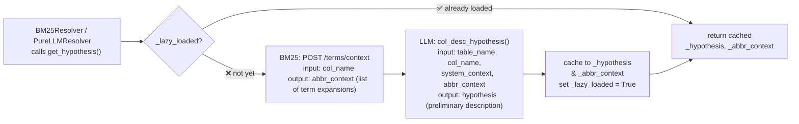

# Flow Diagram: generate_column_description.py

## Retrieval Process — 6-Stage Resolver Chain

```mermaid
flowchart TD
    START(["`**START**
    python generate_column_description.py
    table_name col_name`"])

    %% ── Entry ──────────────────────────────────────────────
    START --> GC["generate_column(table_name, col_name)
    ↳ wraps generate_metadata(force_generate=True)
    ↳ table_description disabled"]

    GC --> VAL{"validate_table()
    TableName ada?
    Columns ada?"}
    VAL -- "❌ invalid" --> ERR([ValueError])
    VAL -- "✅ valid" --> SYSCTX

    %% ── Init Phase ─────────────────────────────────────────
    subgraph INIT ["🔧 Init Phase"]
        SYSCTX["BM25: GET /system/context
        input: table_name
        output: system_name, system_context"]

        SYSCTX --> TBSRCH["BM25: POST /search mode=table_name
        top_k=20, threshold=8.0
        output: table_hits (list of similar tables)"]

        TBSRCH --> CFCHECK{"confluence_fallback
        enabled?
        AND weak table score?
        AND missing columns?"}

        CFCHECK -- "YES" --> CFDISCOVER["ConfluenceDiscoveryService.discover()
        input: table_name, column_names
        output: candidate pages"]
        CFDISCOVER --> CFPARSE["Extract fields per column
        filter: label=usable_metadata
        min_confidence=0.8
        output: temporary_knowledge_by_column"]
        CFPARSE --> COLLOOP

        CFCHECK -- "NO" --> COLLOOP
    end

    %% ── Column Loop ─────────────────────────────────────────
    COLLOOP["🔁 process_column()
    build ResolverContext"]

    COLLOOP --> R1

    %% ── Resolver Chain ──────────────────────────────────────
    subgraph CHAIN ["⛓️ 6-Stage Resolver Chain (first match wins)"]

        %% Stage 1
        R1["**[1] ExactMatchResolver** — exact_as400
        BM25: POST /exact/lookup
        input: table_name, col_name"]
        R1 --> R1F{"description found
        AND source_type = AS400?"}
        R1F -- "✅ YES" --> RES1(["✅ RESOLVED
        tag: exact_as400"])
        R1F -- "❌ NO" --> R2

        %% Stage 2
        R2["**[2] BM25Resolver** — bm25_as400"]
        R2 --> R2A["BM25: POST /search mode=column
        with docs=table_hits (table-filtered)
        top_k=5, threshold=1.0, table_score_alpha=0.9"]
        R2A --> R2AF{"hits after
        AS400 priority filter?"}
        R2AF -- "❌ empty" --> R2B["BM25: POST /search mode=column
        docs=None (global search)
        top_k=5, threshold=1.0"]
        R2B --> R2BF{"hits after
        AS400 priority filter?"}
        R2BF -- "❌ empty" --> R3
        R2AF -- "✅ found" --> LAZY1
        R2BF -- "✅ found" --> LAZY1

        LAZY1["🔄 LAZY LOAD (if not yet cached)
        ① BM25: POST /terms/context → abbr_context
        ② LLM: col_desc_hypothesis() → hypothesis"]
        LAZY1 --> R2LLM["LLM: col_desc_generate()
        input: hypothesis + col_knowledge
        output: ColumnDescription"]
        R2LLM --> RES2(["✅ RESOLVED
        tag: bm25_as400"])

        %% Stage 3
        R3["**[3] KataEvidenceResolver** — kata"]
        R3 --> R3EN{"kata.enabled
        in settings?"}
        R3EN -- "❌ disabled" --> R4
        R3EN -- "✅ enabled" --> R3TR["Postgres: technical_relation_lookup
        input: table_name, col_name
        filter: status=active"]
        R3TR --> R3TRF{"active record
        found?"}
        R3TRF -- "✅ YES" --> RES3A(["✅ RESOLVED
        tag: kata_technical_relation"])
        R3TRF -- "❌ NO" --> R3AL["Postgres: alias_lookup
        input: col_name
        (skip if generic column name)"]
        R3AL --> R3ALF{"evidence
        found in cache?"}
        R3ALF -- "❌ cache miss
        + live_opensearch_fallback" --> R3OS["OpenSearch: search_data_elements
        input: col_name"]
        R3OS --> R3SEL
        R3ALF -- "✅ found" --> R3SEL
        R3SEL{"select_kata_evidence()
        best match?"}
        R3SEL -- "✅ found" --> RES3B(["✅ RESOLVED
        tag: kata_alias"])
        R3SEL -- "❌ none" --> R4

        %% Stage 4
        R4["**[4] BM25Resolver** — bm25_informatica_certified
        (same flow as Stage 2)
        priority filter: Informatica Certified only"]
        R4 --> R4F{"knowledge found
        after Informatica filter?"}
        R4F -- "❌ NO" --> R5
        R4F -- "✅ YES + LAZY LOAD" --> R4LLM["LLM: col_desc_generate()
        input: hypothesis + col_knowledge"]
        R4LLM --> RES4(["✅ RESOLVED
        tag: bm25_informatica_certified"])

        %% Stage 5
        R5["**[5] ConfluenceFallbackResolver** — confluence_fallback
        check: temporary_knowledge_by_column[col_name]"]
        R5 --> R5F{"evidence from
        Confluence found?"}
        R5F -- "✅ YES" --> RES5(["✅ RESOLVED
        tag: confluence_fallback"])
        R5F -- "❌ NO" --> R6

        %% Stage 6
        R6["**[6] PureLLMResolver** — pure_llm"]
        R6 --> LAZY2["🔄 LAZY LOAD (if not yet cached)
        ① BM25: POST /terms/context → abbr_context
        ② LLM: col_desc_hypothesis() → hypothesis"]
        LAZY2 --> R6HYP{"hypothesis
        generated?"}
        R6HYP -- "✅ YES" --> R6GEN
        R6HYP -- "❌ EMPTY" --> R6UC["LLM: col_understanding_check()
        input: table_name, col_name,
        system_context, abbr_context"]
        R6UC --> R6UCF{"understood?"}
        R6UCF -- "❌ NO" --> R6UNK["BM25: POST /terms/unknown
        report unknown_terms
        for future indexing"]
        R6UNK --> RES6B(["⚠️ RESOLVED
        tag: unknown
        description: ''"])
        R6UCF -- "✅ YES" --> R6GEN
        R6GEN["LLM: col_desc_generate()
        input: hypothesis + abbr_context
        (no external knowledge)"]
        R6GEN --> RES6(["✅ RESOLVED
        tag: llm"])
    end

    %% ── Post-Processing ─────────────────────────────────────
    RES1 & RES2 & RES3A & RES3B & RES4 & RES5 & RES6 & RES6B --> BT

    subgraph POST ["🏁 Post-Processing"]
        BT{"business_title
        enabled?"}
        BT -- "❌ NO" --> OUT
        BT -- "✅ YES" --> BTCHECK{"knowledge has
        business_title?"}
        BTCHECK -- "✅ from knowledge" --> BTSET["set ColumnBusinessTitle
        from existing knowledge"]
        BTCHECK -- "❌ none" --> BTLLM["LLM: col_business_title_generate()
        input: col_name, description,
        system_context"]
        BTLLM --> BTSET
        BTSET --> OUT
    end

    OUT(["**RETURN**
    table_name, col_name
    description, resolver_tag
    business_title, knowledges"])
```

---

## Lazy Load: ResolverContext (`_load_lazy`)

Hanya dipanggil sekali saat pertama kali `BM25Resolver` atau `PureLLMResolver` membutuhkan hypothesis. Hasilnya di-cache di dalam `ResolverContext`.

---

## Resolver Priority Summary

| Stage | Resolver | Tag | Data Source | Priority Filter |
|-------|----------|-----|-------------|-----------------|
| 1 | ExactMatchResolver | `exact_as400` | BM25 `/exact/lookup` | AS400 only |
| 2 | BM25Resolver | `bm25_as400` | BM25 table-filtered → global → LLM | AS400 only |
| 3 | KataEvidenceResolver | `kata_technical_relation` / `kata_alias` | Postgres cache → OpenSearch | — |
| 4 | BM25Resolver | `bm25_informatica_certified` | BM25 table-filtered → global → LLM | Informatica Certified only |
| 5 | ConfluenceFallbackResolver | `confluence_fallback` | Confluence (pre-fetched) | — |
| 6 | PureLLMResolver | `llm` / `unknown` | LLM only (hypothesis + abbr context) | — |
